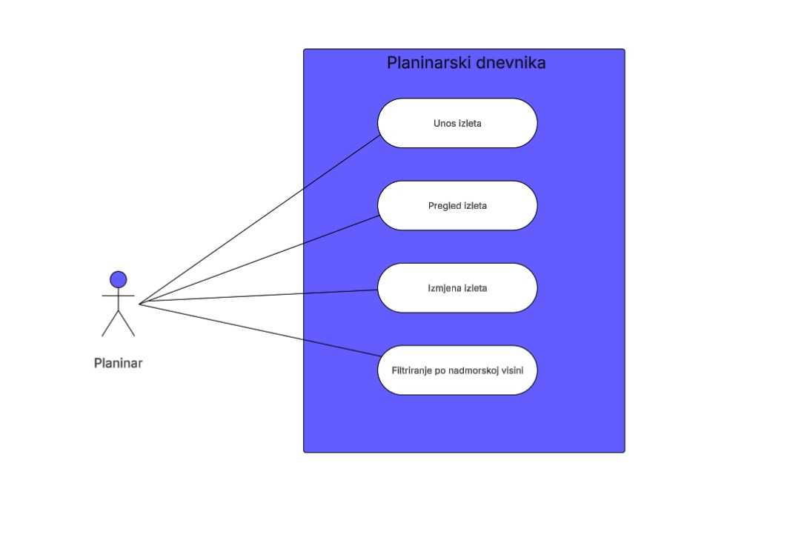

# 🏔️ Planinarski Dnevnik

Planinarski Dnevnik je web aplikacija za evidenciju planinarskih izleta.  
Omogućava jednostavno dodavanje, uređivanje i brisanje planinarskih izleta te pregled statistike i vizualizacije podataka.

Jedna od glavnih značajki aplikacije je vizualizacija podataka pomoću Chart.js biblioteke.  
Aplikacija prikazuje ukupnu kilometražu, broj izleta, prosječnu kilometražu i grafički prikaz planinarskih aktivnosti.

Planinarski Dnevnik koristi SQLite bazu podataka za pohranu podataka, Flask framework za backend razvoj te Pony ORM za rad s bazom podataka.

---

## Usecase dijagram


---

## Instalacija

## Skidanje koda s GitHub-a:

```bash
cd ~/Downloads
git clone https://github.com/DomagojM95/planinarski_dnevnik.git
cd planinarski_dnevnik
```

---

## Docker tutorial:

```bash
docker build -t planinarski-dnevnik .
docker ps
docker run -p 5000:5000 planinarski-dnevnik
```
